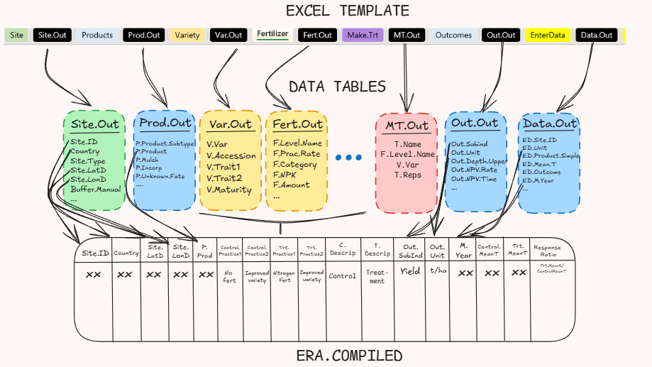

```{r setup, include=FALSE}
knitr::opts_chunk$set(
  collapse = TRUE,
  comment = "#>",
  echo = TRUE,  # Temporarily set to TRUE for debugging
  message = FALSE,
  warning = FALSE
)
```

```{r packages, include=FALSE, echo=FALSE}

if (!requireNamespace("pacman", quietly = TRUE)) {
  install.packages("pacman")
}
pacman::p_load(
  sf, knitr, rnaturalearth, rnaturalearthdata, 
  ggplot2, viridis, shiny, dplyr, treemap, treemapify, plotly, data.table,
  s3fs, arrow, devtools, gh, htmlwidgets,remotes,gridExtra, DT
)

if(!require(ERAgON)){
  remotes::install_github(repo="https://github.com/EiA2030/ERAgON",build_vignettes = T)
  library(ERAgON)
}

if(!require(ERAg)){
  remotes::install_github(repo="https://github.com/EiA2030/ERAg",build_vignettes = T)
  library(ERAg)
}
# Set a directory for downloaded data
dl_dir <- "downloaded_data"

# Create the directory if it doesn't already exist
if(!dir.exists(dl_dir)){
  dir.create(dl_dir, showWarnings = FALSE)
}

```

This vignetter will guide you throgh the agronomy data available within the Evidence for Resilient Agriculture (ERA) The dataset serves as a critical resource for understanding agricultural resilience, specifically focusing on agriculture systems and their adaptation to climate change.

We will cover the following:

***What is ERA:***

*1. Introduction*

*2. Extraction template*

3\. Understanding the *different data formats of ERA*

***Downloading the data:***

*1. Downloading the ERA.Compiled data*

*2. Downloading the metadata*

***Exploring the data:***

*1. Exploring geographic locations of studies available*

*2. Agronomic practices and subsetting*

*3. Common outcomes reported and subsetting*

# What is ERA

## Introduction

*Evidence for Resilient Agriculture* (ERA) v1.0.1 helps address the gap. Started in 2012, ERA was envisaged to evaluate the evidence base of Climate-Smart Agriculture (CSA)---that is, agriculture that delivers productivity, resilience, and climate change mitigation outcomes simultaneously. However, the technologies included within ERA such as agroforestry, intercropping, and crop rotations, among many others are common features of agroecology, regenerative agriculture, nature-based solutions, ecosystem-based adaptation, sustainable land management, and other approaches as are many of the outcome indicators such as yield, net economic returns, soil organic carbon, land equivalent ratio, labour required, and more. This means that ERA is relevant for various perspectives on development and is flexible to allow users to define 'effectiveness' or 'work' consistently with their worldview.

ERA is a comparatively large agricultural meta-dataset in terms of number of technologies, outcomes, and studies. ERA v1.0.1 includes data from 2,011 agricultural experiments that took place in Africa between 1934 and 2018. Together, these data compare how changing more than 364 combinations of agronomic, livestock, or tree management technologies affect more than 87 indicators of productivity, resilience, and greenhouse gas emissions and/or carbon stocks. The experiments were identified via *Web of Science* and *Scopus* and were evaluated against predetermined inclusion criteria: (i) location, (ii) technology and outcome relevance, (iii) data on both a new and conventional technology, and (iv) inclusion of primary data. Extracted data from over 3,000 studies include 135 fields describing each study's context, experimental design, management treatments (i.e., which are combinations of technologies used), and outcomes.

## Extraction template

Over the years of ERA, several versions of the extraction template have been developed. However, the most widely used and thoroughly tested version is the Excel macro-enabled workbook. In this format, each study is documented in a separate Excel file, with individual tabs dedicated to different components of the study---such as site information, soil characteristics, management practices, and outcomes. The work book contains the following sections:\

1)  Pub = Publication: capture bibliographic data about an experiment here.

2)  Site & Site Soils = captures information about experimental sites, any detailed information about soil variables should be captured in Site.Soils

3)  ExpD = Experimental design, captures information about the number of study replicates, plot sizes, etc.

4)  Practices (pale yellow tabs) = These tabs collect information about the agricultural management practices used in an experiment. Within tabs you can record base practices which apply to all treatments (e.g. 50kg of 60-30-30 NPK was applied to all treatments) or experimental practices that different between treatments (e.g. one treatment used straw mulch and another did not). Each set of experimental practices within a practice tab creates named building blocks that you will combine in the Make.Trt tab to create treatments. Base practices you do not need to consider again once they are entered in the practice tabs, they also do not require naming as the spreadsheet should autopopulate the name field with "base".

    Many practice tabs will require you to select and name a practice method that relates to a code in ERA practice definitions, this part of the data entry is critical. After you have chosen a method and named a practice you can often scroll down to tables that can collect more detail information about how the practice was implemented. There are also notes sections where you can copy paste important experimental information that you do no think the workbook captures well. Each tab is a theme that represents a set of related practices:

    -   Chems = Chemical applications (applications of herbicides, fungicides, insecticides, etc.)

    -   Harvest = Harvest methods & timing Irrigat = Irrigation methods & application rates

    -   Mulch = Materials that are not from crops in the experimental plot (record these in the residues tab) applied to the surface of the plot as a mulch. Records the type of mulch & application details . Does not include compost or manures (use the nutrients tab).

    -   Nutrients = Inputs/fertilizers added to a plot designed to improve/increase/provide nutrients for crop growth. Nutrients can include inorganic fertilizers, compost, manure, micronutrients, biochar, biofertilizers, biosolids and other organic amendments. Records the type of fertilizer & application details.

    -   Comp = Composition of organic mulch or nutrient materials.

    -   pH = Materials & application rates of materials used for amendment of soil pH (e.g. liming).

    -   Plant = Planting methods & timing Residues = Fate of crop residues & compositional details.

    -   Tillage = Tillage method(s) used & details of tillage operations.

    -   Variety = Crop varieties used & information on their basic traits.

    -   WaterHarvest = Water harvesting methods (e.g., planting basins, terraces, tied ridges, zai pits, etc.).

    -   Weed = Physical (not chemical) weeding events (typically hand weeding).

5)  Make.Trt = create & name treatments by combining the experimental practices entered in the practice tabs.

6)  EU&Out = Experimental Unit & Outcomes: Choose the products (typically crop commodities) and experimental outcomes for which data are presented.

7)  Times = Select the cropping seasons or years for which data are presented.

8)  EnterData = Captures values and associated errors for the experimental treatments, products, outcomes and times specified in the previous tabs. Do not start data entry until you've completed all the previous tabs.

The link to this extraction template can be found here: <https://github.com/CIAT/ERA_dev/blob/main/data_entry/industrious_elephant_2023/excel_data_extraction_template/V2.0.28%20-%20Industrious%20Elephant.xlsm>

## Understanding the different data formats of ERA

Each of the tables within the front end of the feed into tables behind the scenes.

The main tables are :

-   Pub.Out : Publication information, DOIs, ERA version
-   Site.Out : Location, coordinates
-   ExpD.Out : Experimental design
-   Times.Out : Timeline of the experiment
-   Times.Clim : Climate information for the location
-   Prod.Out : Product
-   Var.Out : Variety
-   Till.Out : Information on tillage during the experiment
-   Plant.Out : Planting information
-   PD.Out: Planting dates (Linked codes in table PD.Codes)
-   Fert.Out : Information on fertilizer use during the experiment (Linked method in table Fert.Method)
-   Chems.AI : Chemical active ingredients
-   Chems.Out : Information on chemicals use during the experiment (Linked codes in table Chems.Codes)
-   Res.Out : Information on residues during the experiment (Linked method in table Res.Method)
-   Har.Out : Information on harvesting during the experiment
-   pH.Out : Information on pH control during the experiment
-   WH.Out : Information on water harvesting during the experiment (Irrigation information can be found in Irrig.Codes and Irrig.Method)
-   AF.Out : Information on agroforestry during the experiment (Linked Tree information in table AF.Trees )
-   Int.Out : Information on intercropping during the experiment
-   Rot.Out : Information on crop rotation during the experiment (Linked Rotation Sequence in table Rot.Seq )
-   Out.Out : Outcomes. Outcomes
-   Out.Econ : Economic outcomes
-   Data.Out : Measured outcomes for concerned practice and product.

The above tables are what we refer to as the metadata, or raw data within ERA. These tables provide you with detail information from each study, e.g fertilizer applied, timing of fertilizer and so on. In an attempt to make the data easily usable, ERA.Compiled is created.\
ERA.Compiled is a flat excel file that pulls only essential fields from each metadata table to create rows or treatment versus control.

Below is a simple conceptional framework of how ERA.Compiled is generated from the metadata.



# Downloading the data

Data is available and can be downloaded from the S3 Bucket `s3://digital-atlas/era/data/`

## Downloading the metadata

Unhide the code the view the steps to download the metadata

```{r downloading data from S3 bucket,echo=T, message=TRUE}
# Create an S3 filesystem handle
s3 <- s3fs::S3FileSystem$new(anonymous = TRUE)
era_s3 <- "s3://digital-atlas/era"

# List files in the s3 bucket
all_files <- s3$dir_ls(file.path(era_s3, "data"))

# Filter for the "agronomic" RData file, selecting the most recent version
target_file <- tail(
  grep(".RData", grep("agronomic", all_files, value = TRUE), value = TRUE),
  1
)

# Define a local path for saving the downloaded file
save_path <- file.path(getwd(), dl_dir, basename(target_file))

# Download the file if it does not exist already
if (!file.exists(save_path)) {
  s3$file_download(target_file, save_path, overwrite = TRUE)
}

# Load the livestock data using the miceadds package
agronomic_data <- miceadds::load.Rdata2(
  file = basename(save_path),
  path = dirname(save_path)
)

```
